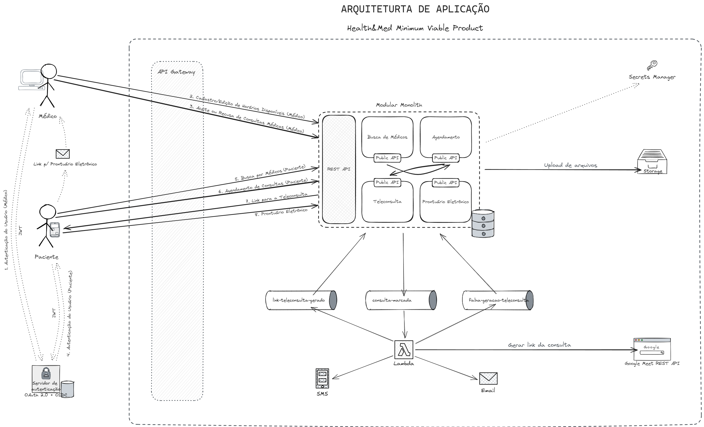

# Health&Med
## API do Backend

[](https://github.com/Grupo-G03-4SOAT-FIAP/Health-Med-api/actions/workflows/deploy.yml)
[](https://sonarcloud.io/summary/new_code?id=Grupo-G03-4SOAT-FIAP_Health-Med-api)
[](https://sonarcloud.io/summary/new_code?id=Grupo-G03-4SOAT-FIAP_Health-Med-api)

Projeto desenvolvido durante o Hackathon da [Pós Tech em Software Architecture da FIAP](https://postech.fiap.com.br/curso/software-architecture/).

▶️[Clique aqui para assistir à apresentação no YouTube!](https://www.youtube.com/@BOPEtechFIAP)

### O PROBLEMA

*A Health&Med, uma startup inovadora no setor de saúde, está desenvolvendo um novo sistema que irá revolucionar a Telemedicina no país. Atualmente, a startup oferece a possibilidade de agendamento de consultas e realização de consultas online (Telemedicina) por meio de sistemas terceiros como Google Agenda e Google Meetings.*

*Recentemente, a empresa recebeu um aporte e decidiu investir no desenvolvimento de um sistema proprietário, visando proporcionar um serviço de maior qualidade, segurança dos dados dos pacientes e redução de custos. O objetivo é criar um sistema robusto, escalável e seguro que permita o gerenciamento eficiente desses agendamentos e consultas.*

*Além de conter as funcionalidades de agendamento e realização de consultas online, o sistema terá o diferencial de uma nova funcionalidade: o Prontuário Eletrônico. O Prontuário Eletrônico permitirá o armazenamento e compartilhamento de documentos, exames, cartão de vacinas, e outros registros médicos entre as partes envolvidas, garantindo maior assertividade nos 
diagnósticos. Para viabilizar o desenvolvimento de um sistema que esteja em conformidade com as melhores práticas de qualidade e arquitetura de software, a Health&Med contratou os alunos do curso (SOAT) para fazer a análise do projeto e a arquitetura do software.*

*— Fonte: [FIAP](https://www.fiap.com.br/)*

#### Stack


## Executar a aplicação

1. Baixe e instale o Node.js em https://nodejs.org/en/download
2. Instale o CLI do NestJS através do comando `npm i -g @nestjs/cli`
3. Navegue até a pasta raiz do projeto usando o Terminal;
4. Faça uma cópia do arquivo `.env.template` com o nome `.env` e preencha as variáveis de ambiente dentro dele;
5. Execute o comando `npm install` para instalar os pacotes npm;
6. Execute o comando `docker-compose up -d db` para iniciar o container do banco de dados;
7. Execute o comando `docker-compose up -d localstack` para iniciar o localstack;
8. Use o comando `npm run start` para iniciar a aplicação.
9. Acesse o Swagger em http://localhost:3000/swagger/

<details>

<summary>Como executar a aplicação usando o Docker Compose?</summary>

## Executar a aplicação usando o Docker Compose

1. Clone este repositório;
2. Navegue até a pasta raiz do projeto usando o Terminal;
3. Faça uma cópia do arquivo `.env.template` com o nome `.env` e preencha as variáveis de ambiente dentro dele;
4. Execute o comando `docker-compose up -d --build --force-recreate`
5. Acesse o Swagger em http://localhost:3000/swagger/

</details>

<details>

<summary>Como executar a aplicação usando o Kubernetes do Docker Desktop?</summary>

## Executar a aplicação usando o Kubernetes do Docker Desktop

1. Clone este repositório;
2. Navegue até a pasta raiz do projeto usando o Terminal;
3. Use o comando `docker build -t health-med-api:latest .` para gerar a imagem de container da aplicação;
4. Use o comando `kubectl apply -f k8s/development/postgres/namespace.yaml -f k8s/development/postgres/pvc-pv.yaml -f k8s/development/postgres/config.yaml -f k8s/development/postgres/secrets.yaml -f k8s/development/postgres/deployment.yaml -f k8s/development/postgres/service.yaml` para fazer deploy do banco de dados;
5. Use o comando `kubectl apply -f k8s/development/api/namespace.yaml -f k8s/development/api/config.yaml -f k8s/development/api/secrets.yaml -f k8s/development/api/deployment.yaml -f k8s/development/api/service.yaml -f k8s/development/api/hpa.yaml` para fazer deploy da aplicação;
6. Acesse o Swagger em http://localhost:3000/swagger/

> Para remover a aplicação do Kubernetes, use o comando `kubectl delete namespace rms`

#### Sobre os Secrets do Kubernetes

Em seu ambiente de desenvolvimento, por questão de segurança, abra os arquivos `/k8s/development/postgres/secrets.yaml` e `/k8s/development/api/secrets.yaml` na pasta `/k8s/development` e preencha os valores sensíveis manualmente.

> No ambiente de produção os Secrets do Kubernetes são gerenciados pelo AWS Secrets Manager.

Para mais informações visite a página [Boas práticas para secrets do Kubernetes](https://kubernetes.io/docs/concepts/security/secrets-good-practices/#avoid-sharing-secret-manifests).

</details>

<details>

<summary>Como testar as teleconsultas com o Google Meet?</summary>

## Instruções para testar as teleconsultas com o Google Meet

Para testar o agendamento de consultas com o Google Meet siga o passo a passo disponível no [Guia de início rápido do Node.js](https://developers.google.com/meet/api/guides/quickstart/nodejs) no portal Google for Developers.

### Criar projeto no Console do Google Cloud

1. Crie um projeto chamado `Health-Med` no [Console do Google Cloud](https://console.cloud.google.com/projectcreate);
2. No Console do Google Cloud, acesse [APIs e Serviços](https://console.cloud.google.com/apis/dashboard) e clique no botão **+ Ativar APIs e serviços**;
3. Procure pela Google Meet REST API na lista e clique em ATIVAR;
4. No menu do lado esquerdo da tela, clique em Credenciais;
5. Clique no botão **+ Criar credenciais** e escolha a opção "ID do cliente OAuth";
6. CLique no botão CONFIGURAR TELA DE CONSENTIMENTO e escolha opção "Externo" e clique em CRIAR;
7. Na tela "Informações do app" preencha os dados do aplicativo como nome do app, e-mail para suporte, logotipo do app, dados de contato do desenvolvedor, etc. Clique no botão SALVAR E CONTINUAR;
8. Na guia "Escopos" clique no botão ADICIONAR OU REMOVER ESCOPOS e selecione a opção `https://www.googleapis.com/auth/meetings.space.created` na lista. Clique no botão SALVAR E CONTINUAR;
9. Na guia "Usuários de teste" clique no botão **+ ADD USERS** e adicione o seu endereço de e-mail pessoal do @gmail.com. Depois clique no botão SALVAR E CONTINUAR;
10. Clique no botão VOLTAR PARA O PAINEL.

### Obter um ID do cliente OAuth 2.0

1. No menu do lado esquerdo da tela, clique em Credenciais;
2. Clique no botão **+ Criar credenciais** e escolha a opção "ID do cliente OAuth";
3. Em "Tipo de aplicativo" selecione "App para computador" e clique no botão CRIAR.
4. Anote o `ID do cliente` e a `Chave secreta do cliente` e clique no botão BAIXAR O JSON;

### Autenticação com a Conta pessoal do Google

1. Visite a página [Guia de início rápido do Node.js](https://developers.google.com/meet/api/guides/quickstart/nodejs);
2. Execute [código de amostra](https://developers.google.com/meet/api/guides/quickstart/nodejs?hl=pt-br) na sua máquina local;
> Copie o arquivo JSON que você baixou anteriormente na mesma pasta onde se encontra o arquivo `index.js`. Renomeie o arquivo JSON para `credentials.json`
3. Execute o [código de amostra](https://developers.google.com/meet/api/guides/quickstart/nodejs?hl=pt-br) usando o comando `node .`
4. Ao executar o [código de amostra](https://developers.google.com/meet/api/guides/quickstart/nodejs?hl=pt-br) será solicitado que você faça login com a sua Conta do Google pessoal;
5. Logo após, será gerado um arquivo chamado `token.json` no mesmo diretório onde se encontra o arquivo `index.js`

> O [código de amostra](https://developers.google.com/meet/api/guides/quickstart/nodejs?hl=pt-br) também está disponível no GitHub em https://github.com/googleworkspace/node-samples/blob/main/meet/quickstart/index.js

> Também é possível fazer autenticação usando Contas de Serviço ao invés de IDs do cliente OAuth 2.0, porém é necessário possuir uma conta Business (paga) do Google Workspaces com CNPJ para configurar o [domain-wide delegation](https://support.google.com/a/answer/162106?hl=en) conforme instruções disponíveis [aqui](https://medium.com/iceapple-tech-talks/integration-with-google-calendar-api-using-service-account-1471e6e102c8).

### Informe as credenciais na aplicação

1. Abra o arquivo `token.json` e copie todo o seu conteúdo;
2. Abra o arquivo `.env` e cole o conteúdo do arquivo token.json na variável de ambiente `GOOGLE_AUTHORIZED_USER_CREDS`, entre aspas simples `' '`
3. Execute a aplição.

> O token obtido no arquivo token.json vence depois de algum tempo, sendo necessário gerar outro token novamente usando o [código de amostra](https://developers.google.com/meet/api/guides/quickstart/nodejs?hl=pt-br) conforme as instruções disponíveis acima.

</details>

## Banco de Dados

Entendemos que o modelo relacional é o que mais se adequa ao nosso problema de negócio, contexto atual e requisitos na API da Health&Med. Leia mais sobre as motivações para adoção do modelo relacional no [Architectural Decision Record (ADR)](https://github.com/Grupo-G03-4SOAT-FIAP/Health-Med-api/wiki/Decis%C3%A3o-de-Arquitetura-para-Banco-de-Dados-da-Health&Med).

<details>

<summary>Quais são os parâmetros da conexão e credenciais para acesso ao banco de dados PostgreSQL?</summary>

<br>

Você pode conectar-se a instância de banco de dados PostgreSQL usando o [pgAdmin](https://www.pgadmin.org/download/), o terminal através do [psql](https://www.postgresql.org/download/), ou qualquer outra IDE ou ferramenta compatível.

> Host: localhost\
> Porta: 5432 (padrão)\
> Usuário: pguser\
> Senha: pgpwd\
> DB name: health_med

</details>

## Documentação

A documentação do projeto está disponível no [GitHub Wiki](https://github.com/Grupo-G03-4SOAT-FIAP/Health-Med-api/wiki).

## Arquitetura de Aplicação

Architectural Pattern: [Modular Monolith](https://www.milanjovanovic.tech/blog/what-is-a-modular-monolith) + [Hexagonal Architecture](https://alistair.cockburn.us/hexagonal-architecture/)



*Clique na imagem para ampliar.*

<details>

<summary>Por que optamos por um Monolito Modular?</summary>

## Modular Monolith

> ⚠️"Você não deve iniciar um novo projeto com microsserviços, mesmo se tiver certeza de que seu aplicativo será grande o suficiente para valer a pena." — [Martin Fowler](https://martinfowler.com/bliki/MonolithFirst.html#:~:text=you%20shouldn%27t%20start%20a%20new%20project%20with%20microservices%2C%20even%20if%20you%27re%20sure%20your%20application%20will%20be%20big%20enough%20to%20make%20it%20worthwhile.)

*Ao optar por um monolito modular temos o melhor dos dois mundos: A simplicidade e facilidade de gerenciamento de um monolito aliada a modularidade, flexibilidade e baixo acoplamento dos microsserviços. Leia mais sobre as motivações para implementação de um monolito modular em [Decisão de Arquitetura para o MVP da Health&Med](https://github.com/Grupo-G03-4SOAT-FIAP/Health-Med-api/wiki/Decis%C3%A3o-de-Arquitetura-para-o-MVP-da-Health&Med) na documentação.*

</details>

<details>

<summary>Por que optamos pelo Modelo Relacional?</summary>

## Modelo Relacional

*Entendemos que o modelo relacional é o que mais se adequa ao nosso problema de negócio, contexto atual e requisitos na API da Health&Med. Leia mais sobre as motivações para adoção do modelo relacional em [Decisão de Arquitetura para Banco de Dados da Health&Med](https://github.com/Grupo-G03-4SOAT-FIAP/Health-Med-api/wiki/Decis%C3%A3o-de-Arquitetura-para-Banco-de-Dados-da-Health&Med) na documentação.*

</details>

<details>

<summary>Por que optamos por uma SAGA Coreografada?</summary>

## SAGA Coreografada

*Devido a pequena quantidade de membros, optamos pela SAGA coreografada, conforme recomendado por Chris Richardson no livro "[Microservices Patterns](https://www.amazon.com.br/Microservice-Patterns-examples-Chris-Richardson/dp/1617294543)". Leia mais sobre as motivações para implementação de uma SAGA coreografada em [Decisão de Arquitetura para SAGA da Health&Med](https://github.com/Grupo-G03-4SOAT-FIAP/Health-Med-api/wiki/Decis%C3%A3o-de-Arquitetura-para-SAGA-da-Health&Med) na documentação.*

</details>

<details>

<summary>Por que optamos por um BFF?</summary>

## Backend for Frontend

*O API Gateway como BFF funciona como um único ponto de entrada para o(s) front-end(s), que não precisam conhecer o endereço de cada um dos serviços no backend. Outra grande vantagem é também a autenticação, realizada pelo próprio API Gateway em conjunto com o IdP Cognito da AWS. Leia mais sobre as motivações para implementação do BFF em [Decisão de Arquitetura para o BFF da Health&Med](https://github.com/Grupo-G03-4SOAT-FIAP/Health-Med-api/wiki/Decis%C3%A3o-de-Arquitetura-para-o-BFF-da-Health&Med) na documentação.*

</details>

> [!TIP]
> Os ADRs estão disponíveis na documentação no GitHub Wiki em https://github.com/Grupo-G03-4SOAT-FIAP/Health-Med-api/wiki/Architectural-Decision-Records-(ADRs)

## Arquitetura Cloud

Cloud provider: AWS

[Clique aqui para ver no draw.io](https://app.diagrams.net/?tags=%7B%7D&lightbox=1&highlight=0000ff&edit=_blank&layers=1&nav=1&title=arquitetura-cloud.drawio#R%3Cmxfile%3E%3Cdiagram%20name%3D%22P%C3%A1gina-1%22%20id%3D%22QyuDZeAoyNbm0Pvu70TN%22%3E7V1ZV9tI0%2F41PmdyYY5WS740BhLeQMIHyWQmN5xGahsNsuRoISG%2F%2FutVlrrbCyBZclBmEnBba9faVdVPDczp4tf7BCzvL2MfhgND838NzJOBYZiO4aIfeOSJjui6adCReRL4bGw1cBP8hmxQY6N54MO0cmAWx2EWLKuDXhxF0MsqYyBJ4p%2FVw2ZxWL3rEsyhNHDjgVAe%2FRb42T0ddQ1nNf4BBvN7fmd9NKbfLAA%2FmL1Jeg%2F8%2BGdpyDwdmNMkjjP62%2BLXFIZ49vi80PPO1nxbPFgCo2yXEy5GN8ePi6%2BfLhP%2Fg%2Fn%2B9Gzi%2FLwdsqs8gjBnLzz5doMGpmGc%2B%2By5syc%2BGcs4iDIyofYx%2Bh%2Fdb6oNbPTNFH86MmxhQPzsVAd0%2BRO%2BRnVA%2FOxUB3Tx8rpwf118wNKA9KlyeU24v1Z6QPS%2FeRznWRhEcFqwnoYG5wnwA0SSaRzGCRqL4gjN3vF9tgjRJx39%2BvM%2ByODNEnh4Vn8iuUFjszjKGPPrBv%2FMJh5fFbF3BtC9EnYNQgmYnD5CShB6TBiCZRrcFWcl0MuTNHiE1zClF8ejiBGX%2BPfFrzkW2iPwM7WO5kmcL8njn6N7Kb%2B9Rb%2FeepgxbkGY4QtlSfwA%2BYsODBP9d4aZ73gWhCEf9%2BEM5OT4R5hkARKtSRjM8S2yGN8RsE8hnJGLookJovkF%2BXRiamwyVHfxQXoPffZWsjhw3kZ3hb9KQ0w83sN4AbPkCR3Cvh1aLpNVpq3MEbvGz5XoGy4%2F6L4k9%2BZIY6OAKZx5cfmVTKJfmFiqRRR8d5xRkHw%2FvYzjf6x4qJt3D0NdM9cI6amPdJeh3cDkMfCQkhTFtUwFxoYSyezJaOqOypOpr6WUyJQCXYpLqRi8xP8ypTaqpp3J52hV6hWat0I9FfGM5mhnS7R762RyRTI5MplUVDLMxqjkjCQq3WDVGWRPxDHBqvElVDs5MW08FS8jVHF2W4SyBEJZukyp8UhBquaUoSvrQokyiFyRX9iFLZOnIGNj8zkS59NWzKehmE%2Fbaoz1OUlL8weRWeFsGSfZfTyPIxCerkaPqzO8OuYixnxN5vU%2FmGVPzKMBeRZXZx3%2BCrJ%2F8OnY36If%2Fy19dfKLXZp8eOLiEcY%2FJ1GAHOuAeCjP5%2F00zhMPbjjOYoogA8kcZhvmbWzRA%2FFcbaR9AkP0vI%2FV1UT9ZDTsNsjYKYoYbVFk43PXpqia0kq2oJV0XeE26bZKLY3r8JuUb8GDBI2oeWRaZzb%2BTza59I%2FKlI%2FInybpIKw9dEuT6WCqrK1Vh3VQvoRMhckC%2FEaijtYeIUiRS4N%2B%2B5jfwSSCGV6A8LUI%2Bu2v04837ySipQ8w8%2B4ZzZThBGVIQRVWUIYW5PBC5TCy4FfcQRxUjTnyoC4fxmME8qBqTBUQEc%2FWFWfrwtnrwxHr1s6CQJyeOLqmqRh%2FRv6Iq23u0F6AOxhexWnALMBdnGXxYuta34M4eiGI6JYQCEiX9LVmwS%2F8HOo4RgKpSaFRjGP0URXPgA9pg6Ksm6aoUxWybKlEuTFJltehiE8QrfGZyxAgx1cUVXm%2By7JbIlyFMYgeToXgVpXXDNexT42NvCZqhiNNI7x%2BNDIFqWQiI4yOlaMqvTEer7mwQ85G3%2B%2BgGnCUu3IskUeRPx8KRXkUIJ7EM7AaIoLEJnTJY3AeJdEtJZB5HArSVojRVnGUBE8tn01JhGMLAmEqFv22SiDcpjyMuheSjSkTzdrBMTA0fa%2BOgSPN3qfY73VIGzqk0BYRpsABKwld1%2B0ju2N6QhFwuobzgPjAAwddU%2FtKQvHIG8ZO799BMg%2BiALwrvs7TIURfFgvePpvWZ9NINi2hbKRQYZo2sSYjdXCyphyabjmnxxMxn9CUZAtLW0eVmHFUEQbDHjdlwlzZI6ZZtYnnIbuf9eLaSXHV2hJXwNhCIa%2FTE8MYWY3Ka3GLLTnveuRV8DgthbgWWbxKItVuLCKo64cSUF35LIUTYyDnU1VJoHN3p%2FbkmfpV7LrDqo3NoaWJix5F7tFQmYyihqP%2B6eO3e0NRad2ybWJaKrRwLIkWuooWTnOkkAvX7iEIs%2FvhAvpDsAwG5iQEaJkk23FuAYIFKf0r00OtrLeum8iK6xh4D3NCfcECkPtM%2BEJYGclkj3Jyn2W4rHGCJ8c48%2FxIJ6u8WYBYKjny0M2MMx9kAP3A4yn6mUfktyG2xcPHOByi9cqZYeEDY%2B8BJmiq3KNlNG%2BOQcYjmUFcQ2IQ01XYi6ZWbbpRt6Y7UFEt%2FOcWRXWHSFsfJ2o91ryM%2FYMOHlmmdWSI3D%2BSuX%2Bv0SPdsHo71V07ZY%2Fdtu3UDvWhb8FOOZpMiX3bKXmB2YtqZ0TV4ev%2F9kRVznn1fkzvx%2BzDjxk5snbcsx%2FjSsx%2FOsUD51GagciTU799pVdlrK%2F0aqnSyzMaldaxJZkqU1XsZSik1WhMWse9qepNVSumyrLk2PB%2BTZVZd5S%2BsfkTNyx2KFEkhy26OoemJoefO5ArMuuewQNY2DtuJ3NFphxj6Rf2rSzsXaOLuSKz7sqCAxXVDuSKzD7G0juuzTuuzqiLuSJTjrH0dqozdqr9XJG5w6r%2BLdipDuSKLHmN2YtqZ0S1%2FVyRJZen9X5M78fsw49pP1fE49p9rqjPFfW5orKp6mKuyOrLM3tT1Y6paj9XxB%2BgLfQzzHIr%2BDPCepsQ0PCHK5gE6O2LzXCIUMkTvZrNPxZYavjD6lLk01P5k3ixPQB66SzEVwb0WrPjix1ZH6IXOXWSJOCpdABTMKsrX%2BGBFeuOxe1cI1YpeLbjCYbGlPy6ExAb2hvPQL%2FQp16xevH6r%2BH%2BVkDjeu7fiftN%2Fa1wv%2BO0wv227Pj0GCY9hslra2JEGD%2FTbTuvYMv5757Re0Z%2F7WpWlwtv2ud1vU8gd4LPt6xm8dchzJrTwoaghV1FSdieOVPO7vac2UHOvF0m8a%2BnBv0Du3OcKeeVC8QdX%2BLRveUvy8z5hycxbREe09XlJM5e8WKL5Wevrrqtrho2pBJwq6u3HbPdBRu%2B58z2ObNhQ%2BrqcmVQB5hTDir1tnS%2FBUFiAMbl%2BqE1W2o5EuX30ZxFqO6bzQzPU2kuf3Q3skeK%2BHc1wF4Or5ei7c8JsD%2BP6NuD6dxz3docpplMkhTKNiwxWj62Ba6ij8rOWzHWc8Pyui3dydocZpdQWLefYYrGf8xKUBtOS7ltiMtLGb1GMWtaXLhxaklcns3jY3F%2F5As4tnpGU6mkVhR8n0jdKZHKl9J%2FfiLV1jef0RT3t6Ove%2B7fqYzAeCvc7%2FKi%2B71yvwLdEmaevNTrIxKtRyQIXQ445ToSu4o5fKCtcIe9w440GPlI7OKfeN5CkKaBV%2BX3qiEoKeJx1Q83XqKKV0YCMVXZRozHz7YRXVLrXOts1epbOIOPvXLdq%2BsSa4rRFPru0rpXcSlxmToSW4CsWUK%2FQKOPrS%2Bf%2Fzf%2FffH14VP28846%2Bf00ux%2Buq5bR3iv7gPdtQbrQFqS1Lj7QM24Dtq%2FpFj8RvbmiF7w7GummYL%2FrbRJS3GIvTULGY0FQDcVeFl1TqR2njp25ysjFqJ2C%2FjXLh5WVam35oJwlW9FUezPuY0f6nI%2FaqVj%2FY8nLt5V1hbyyPznB1DC0G6QdA5w10ua9FX6DVnjKl1wbW3QhXrlNKafcroz3DTHF7PFqtMvFMnCrGdZX5vsL0TmG3aBh1jUxbq7q4KVrpsoyN9bAq3ZAvOamT2y42xlYRhmobBrGuY%2BGWKfoEPGjoS1ABOb4tz4G1bUYlHfr3RZ1GocYhHK5jS428baOmyWX%2FE%2BuzjHnw%2BSxl4IuSgEBSPqDZMAej1QGYr%2Bx2B1wHPZRddShKCm3l%2Ftf3aiDtrIHdOMhDZOHvZbqopZKPTKxf5Ceaj9htMMi4I0pKa4VOqKkFNvUpv3a4iD01YGvLKT0dusrC3uHzcTPTG8X%2BWhewlRKbr%2B0YskpUuPl3PZBVy3tmnXYT3pbquoeiVXdu2a3bXFfshQsqi%2B5vaZYT0aulXi6I2E4R9FNQtXZQ18hi1XUgjNuSC%2B4b7BhgG50sbeHAme3x2FuZduVPupiaw9tB9CFtyCpHWjtoe1QK9gvIlpfRBw6zqiudbG1hy57Xb2d6oydar%2B1h74D2sZbsFMdaO2hy3mUXlQ7I6rtt%2FbQjd6P6f2YVvyY1lt7KDpp9p09%2Bs4eb76zhz7qYGcPq4dC7Q1VO4aq%2FcYetryg6jGve8zr1%2FK6LS9Z28e8lp2yns27p%2BebRurUxO2YrtEyY%2B7SV71nzPYZs2GgTt2WHYTWedOSE4M9Tudeo3uGBNFvyE7jfnE6uSXtgaw6WBLGaPPn41gVbLhnFLdRz%2FxdZX6z9o0snWV%2BXrTXFPMrIX%2FklB%2FfV4tco8fAJ5XvZFOhICEKR2D3xesOPoDau6Au7TdmJpVOrqa52hnbUu%2BT6mRNdKJFzzGIU4e4DemRR95%2Bw0q9Ka9A2rFi7Li6NmtwCpSs0XKD2IpOfLZC3IcOU2CNbJKx%2FW9zUT6Noi4Qicv4bDA%2BHrjoS%2B10QaXfzwdTczBxyL9mjBdj6CXSDCxipCm1PAvC4DeIfAxSgv8uw3w%2BDCL0G8EMm346J7PtJ8UFNB9gbfLthjjs2mf8YQF%2Bx%2Ficv6%2Bmq5PQlciFZjFWPx9XC7uBMQoxItQdGh%2FNM0JUaaT6Op%2BX%2FImX5Go5fr0qrpkW4Yej%2BTwfIq2HPwL8j5enBIRlAQJ8hTsQ%2FMIff%2BTsvdECA%2FEToCfgeVgKc8a2YocwTen7RNALyDQsYRiz2TC0M8RDIINb3q8ki6MfeUyG4wTp6KFH9d%2BEEDb5azgsj7%2Bjl2FnrJmmT3GaxvLMkDc7%2FYifkbzTmL10TOeFTqmJeS5KM3KEEXkBSFfziQ%2FLgiX5YRwtoB9gCjybjFNAZq16m%2Bo1S08IluA3Z0T4C3o5ElL2oFexzzkxQu%2BMf4JliEyNgtt%2F5JDIJfqJT0f6d1Gw99VXfG3019aNy4APL%2BACX%2BHYTAKAqKldUsaRZ6f83IhHVgxD7G6KtBZ64XTFJ3Q2S5hADBSIs%2BKUPU2K%2F0FMhhkOX1NPghizFVhg%2BxndpUv1bG%2Bb%2F9P1gl%2FI8On0mrIHFQ2OjmNo13AepFTJYXHBU56gk2BEqIKfeA6RVkZTk1CVx2hDpg6v9PHCXfs8PecMdUJW6i9RBxveQ1RgN8XtqJDeQC%2BB2EtEVGVbAanm%2BOimpTfDU0%2FeAx3tk5ciLJDil8AUOXmEZABkCXikLJvye%2BYLQG6UPAYenHgeMqcZpS1I03wR0IelRyVxCPkDnk8ui8nwg8edZ4MoDJikJRUdVzQuJs86e7CSN%2Fw4jzqJ09Eb4mBK%2BTEERwL5RFnV7lfdOFblpcAlEpAB1V6iqkKw6pk8OxGzCHyfeDg4V38GFkGIvY%2BLnCnzKfIdY%2FJ9xetsyllcVQZyb1Gz9CLUWC4QU1UQWo5b5HJqBzJTQJIU6iEEKZpcOl0K3SCGHvsCmvJYX0DTVgFNk8s%2BYyRCbo11WYwtRZ1nHQkCNYaiHBMgzrkgnj3uYBdwBwvduG%2F038elpwy%2FuFPr7OxMbbxrAvudTI6dY1dUM01JqCmYWlcRlzEKAOCyhGKz%2FHoZXQNfOm4lOvPHd4riWvVQGkUZkvk4wGZoakRcs10O%2F8MAj83as4ivcjJ0ox0FtuqKUY4v86%2FWxJe7yxNqHabgiTVEMDrFFK5i8fgIArRYD8Igw8%2FxHTsSIt8oPA3JsOiWc3o8GQjIxGqHRPS3BPejuFRb8CAFOhDPFI4UBfdqj8StwSFRk04uxexJpyj9MTtIOrlgvCfddmjxLpDOVkgdCVVTGOD3IIM%2FQR9ZO5TIWrF2fhuRNbAMbueMRZs0l2Nd3LrgKGAx9htjkwvEV9Hxixj46AeiE95YmvTi24tvF8UXUoa9DRG73t4RZsUp6f1K8sostybKLfds79yadKOnsnVNareGXK5%2BHBm%2BaBrPowCXYfRq%2BSDU8smJaVnTN6OWPcaeDephJCed86j4%2FQ8jIdJ9Nax1Sg07ihgFLyu5PrkZFNVXSF6zeQJv%2Fu9Crn26RP5K704fjN6ejg1b3bjuj9TbiZ82Gr4S0n6Go%2B%2BGVCECfr9Epm%2Bv%2F%2FE%2FTufhUwRvrp9m%2F7rT73YBdX4YGnsPyplXC2zP22gdS%2BbJTvI1knxSHC1ncXt92019%2B8bCFwnm0FvbbFDpOkK2x2zbSVYgOH6bnPUSeiAS%2BsZWsj%2FBrEHhdPn%2BPS6cmtGycMprHLIX9yyJIwXibi%2BjnZTRN2ZFyX7pGeHQ5kR1rFndsqOOnL5TbA7rJfYgJPaNWdWUMuotb2fYYMzBlnHuTUORr2sq7KCWXbkbSy%2B7vez2sls1uQIU03jHRjKNiS1vqFWOMZHA%2F2UeZsFw8h39eoKmQ5uG%2BfYw%2F7N4bs0urt3C1ezgznGhuGlMX8uZPuI3PMe34Petf3frsflt0G6YPKDIY9WWoolXUwB5au6Tuzc%2FP%2F90DUldVwIp3ERvYw7DxvR5qFplW6salr3modSyLS%2FmetnuZbuX7eev98TdLa3Ltm60g%2B35wurMPSSZx8yP3ppkdluDrdv43JL%2Ff7WC8O69%2FVq8fQqK3uQuuLHgAxg7gqI3pifGW1ERMVjhHYg8gpFFcLeAT2DEIEN20wcV7DZ8HEHOwphziv10BPIrmGHYMwKzhTG%2BCFw59yFS8ivwh3EUPtHvsRMyCwoIujlyS6IsSNg3IMQw5%2Bii6TKOAnwz9IjbIAXVkImF58OES5sROL2YPhJ%2BSxhkYIEevZgOZG0Q9TH0nU3ejb5LvGbW6Nsi3Rfc5QzUjMOnkSlF0gD4GwwYWp8Cpe%2BlL0f32kyBd4%2BvTlEmr6HPcNqSgp4ESX6eM4BH%2BkrkAR8Dj0gxRkBET4Wn6OLsK%2Fp3iH%2BDALfI1M4IcGCUYfJpX1PoyyRcACLcjFU89kCErzh%2F0X%2FRnM%2BClLAWeUoGSImGPfJ4L4PGRH8%2FXmI6czg%2B9oTePXiEBWWTYJnFSEfMCOAimYrjMk1P2JMSlsGU5WB%2BHOeSoX6%2B9BHXo%2B8Jj53C6L54xDzNCwBEMmE0KkS%2FXM%2BTRALjTESD1LCRX9ALZsTDp%2Bc6nHYOET3wYjpMEg9vbPWyPCFzCj2iSAhjejF23Aztr8nJ9btCxDmYIFZuEX1tL8cyKT07ASl8H2Qf8jv0y7fggcJVZiAk00VUzSJGNrx0JhNjCvCZMZFIuSwiCY3D1VwvYp%2BiVGJfwMNMGu4IR7gGL1A%2BdR2oK%2Fp5R3EIF8XjrtQw%2FkQgNk%2BeInQCCRAqECiREQFVeQPJjzx4ZL%2FSA%2BkXZC7vcu8BN7Shb39jlpknRTJM8BlnIVWIhEav430MlU3gWEsMf0fG0k0czZQ4HaGTdYd3bfFz%2BKQcrSOD4FT1sI2vdHxcsQjXUu5eU0U2R%2BMjuynnRw5ubjCQvaNdi6PNdk%2FiGb5F83ubkNltkPdGjkMAWsvsp6sKKewjw9hjaH0s52OnmE4zNDmkhLjPyR5WTO2N5WS9FbPyvOxtk0XFY16nyPEIW14665ouiWaLIbYOdLzZWN25Ne7G9WFH4m66JnsHN%2FcBDP1eIfcKuYsKOaXc2WTleDV8qXLi95vBlPdf3fT7rg5FPJ3JRNdHb0c8m3SOdLEVsOW0noGUhVMR5yHbsDTwX%2B7zYGYRGl7boUZLIY5N0wgP6f9Cgshx9F9OA%2FOrGDwLoTK7PZXjZkmcwTnceDcCO46%2FzcCPnAQHT05iHNTto0Q1b9XWJXgNVYLM1Myi5UeZlfU6OsJtxost8fIqsNqbm4MwN2%2Bs5MUn%2FOnfNbkiF9vWqsJq%2BzU6prxoI4m%2BXkYPQkbf2IrtAT6x0BlOX96mtP1ZoyZ2ZB9Vhbb9jUk6h%2BhvCxLf%2BSMg8TcWs21v69Et%2BEHdbLk3%2BZ%2FRJuF1PFFY064wxeigilo7H3HnoHidIa%2BcEaXrdwIH8Q1gl6335PbnyfXT2RnH%2BNTRbef4zTjGBF3jJxb4W6NBd9gYsYZeRdjUcdsOmzpam44P%2F%2F3fqmO8zfGpmMUugMC%2Bsj%2FUqGO5aB4VlS0jKdTurWJvFQ91Onur%2BAyEcyLsTdpDbn1Wdbotm0NFil9VLV5t%2BzQCC0y36C7FP%2BgeHpLByzM0Y4oUH60av6R5QT%2Fw6AYn9PcKeAHbqLQhy1h0RsBjbNPEfZwgtkj2mCYsuPjPzxTaQidAW1XPq2pJVmSlG%2BBUfSdO5Tvs3%2Bcg8U9ysi9uEWP2KbaB8YRzsSXqZ5w84G4z6aDYxeFDvGeGbOLADgjZMEb3R4VDXIkdkd0odPcDYdwMLpZsH1vYBFMmdJLfavLakBoSqzLXIwVLGs2lrRV9RW8%2B9dmw3r3ppHuTRk3uA0Fr%2FeomEN3m8c%2F2nJt2OgEo1%2Fpvdanv1t7Q%2FpU8IQfBN7kRRJ%2BT3dc3wWIZYpfhU8z2ZdBttDcsq0y3z1LvAQ4XIAjJfkj8RcTOEN1idjTxQUqeMC6jC6JZnCwA3cL%2BI2e%2FMO8lzemWfOpP43EP75vHl8rJTHp5WmySjqued19XV7vm0wVvGX3WikK7sntiqDzmOtyTfz88%2FW%2Bh%2FU4f7q5uXMs2rpa%2Fn4ayv3zzf71z0jsn3XROfjTpnFhGVUL3urvNg%2F%2Bc%2Fh3%2Fc3Gdacl38%2FO1vhhOhn0d3SELZ19H13AdnbjdonV5VbSiUriNPNBUIBiRmCUHDtY%2BujzuWd0lsQ6GaFBFDZpBGgQlUCGFh1ou3tAu4nnaR58acPEEA6K7isi9MvxUi383vHdzJzv%2B7g7%2FPs%2BW%2F3wxp%2BHF0GhzcStU8BUL2mdV8HVgT%2FXrVrdOa3lsJUfIezP3yREvCnf8YQzBzVRHGMJqhSG6S9yNNCsTd5PP3hHayiUrF8ip8HuM6ENZRJyeOLqmvZlFREi5c4%2BLfGuP1RVKEXW6Y493LjXsXA3%2BzgZ5UxC0Izq75c7UnaPtJpKVSbvJAHaEtIruX30pwOHY4jcWbW%2B0FECM3hmjPW6BVQonj961pHj1itrtQlJ%2Fk0LdqnhrD3qQUydJgmtLiwOYdlxd%2BQoPlNw9yxa4jIGWrBiFXnLFNsWzvYKT5GWXEAeeDAhQuaIGFv2DFNQDD%2FhmMISlZL4Y6aWQOAl4pHFiDpFdrb19H8dzUpRwCQlu9PXpzZcBq9fFZQQEo3oWJ0gjQp%2Bg7cJfiKdwBBl%2F%2FSPH5y5jWqVQjTpj2PglKe0l32LMfDJIqnKXrIaXfFVGRCdI9wHu60aGjAiSoaKCAf%2F9cDXh88Ei4gSXn9RaqgPhO4J%2Br8PyxuKxKrqgyONoTsgdyVASezBNC5jrl5APpCkF5Y68JI5K1R10jlP4H6nHiPlhFF99w6wC8ki0cwD%2BMohKHRh%2B02fPycPD%2F3IfzRifvyVMaO2It6nFAZ4WUnANowrxKDQ%2FUgESr%2FEJT5cgqujS0Y88JpQA3sOcaM2hRw3ohDw3Mo4gpBdgR3KK0dYSBUY4vXKVvDXe7WjLrbaDxdeGM%2F%2BVILkvYJTipJog%2Fcv8DpOr3OVATcCIdn0gR6xelzPlcAESepXVRNDcEakDwWyFeKfg0HwhVBdRdG52kQ0483ucNkxhHuXSZnnEm2WwKqsFJA4F4qr74QL6Q0FEZ2A1x2AXMWcY5QtZvnn5eLC6IoweAzAMy3Vd5Fda1lUoHloaRk8%2FIwJ8c8naW%2BRpSUmWK9DW4ug3OdVL0q3BTNlEcV25QQWyPgU506XTgql253MVcdVcjp%2BjQuAhfko8fUpuL1s7nI0NEFkZXYTGLGm%2BCLaIXjeEYQqIxQJenNCtDeGcTveM99%2BId6bds2ilJgi5KyGCB2JB9EokobZNxgBcLPGNM8p0SbBJ4WxsbCGl4NexVVE8WUmrr7LpzyByX1BZ6%2FrRlqq1FIFcZZ9eR69hBbkGq8WQHP%2FzyWUf4DmQAM8bq9gKfLwRM3u6RR7FLfCwRS5VcDUouysR5Phn%2B0Sxvr3%2Bx%2F84nYdPEby5fpr9606%2F20NdllyyuV9YSa%2F2C%2FYi3Yt090R6jhnUxwy6xw3qql2W%2BxVeUy28ReuyXlgPQljfGBg9baLXoKTKLd%2FGewQHVouqvOFIsT4jTvNq8YUmmCwF2eLMJ%2Bs2ULSeJHvulL0nWbvILKFrxsl4HhTNMyl%2BfbS68neY4HO%2BJDlpoEouHeWPeJWLV74Jvk4QzYNV%2BAXwgDCIacNcL0%2FSUjfUmlb024KceCk5ZEyNg19sYSjHNoWZ%2FhJTaAJAe22ipXsAi%2FaMlATpai5XfVXTQbFn8AtMEoCjXwMa6kK8ma4wD9hBtPnntsBqCyvot16wbgpraNPkG3G3Fqxzk1u%2FgminHqq7W6vXNMZS5GE3ApHuvwJGSV5FQ5IeXrRFd62fzs54v2%2BsvGhP8KJSnZHTtgtstLMD5%2FDrjDYalK4VGjkMQ6SuQiO1cZeM6Wb4vE2GVam61rXJrmo027KPR9YuDjg62HXG%2Bnh0MMoMPXxOFpDoeW7zFK1vBqpG2xLzP1tRIU9NcMfRREmaSlcC6mk16Colg8lR8Z6JXstEPsQb45tjI82sspGrqdhofGSPZU5ym2KkVjYZ7mamdl1zGTuuuGyjEYskmZyhYwuEtp3qNeijstMEAtZgfeQq15PzyfvrySUOQp2con8m1%2F%2F39fzL6Zev13hoevH564nEB3IYZ0uBQxFE2R6gKUurziJlNzy0Ior36DlxmY2s9BqlbymkVYkJ1Rhi5Ugi6zSk5WkkuviBlM4VmVH67yWacjly%2BTe2liyASM591I70F0f3aqp72UbiZqhq7UjVUVNUdSWq0rCsNPFbjWiJJDva010suqYdn54ZKgP6O0%2Fg0TzI7vO7Ww9XoasMZy10W60Ni6IiBULbXuEprZZ35%2B9tsbirFebWdXvgs5mFoWyGR652pJX%2BVBeCY0tXfcuvT99XMtHPXX4ORXhBlymcs11PcKx6N8ZsJF5JC12RmlE0do4lOoKZxO%2FbFxjrAmzrFh5VzUMOP1mnpjq3wFDpPuWiYx7Gd3UZNEewZ64uJ4osV9aLfKx%2BczZuVS%2FWEkSrsqEPoDvzVOHfkefCu9mrtKa7o9LsGA6vIWOnvyRB%2FvxdQNVM%2Bb72HonlhvT4WQJw6UGe5UkFz3eVkB%2BszcejE3l1vrhPq5SrH7C69t0S9a8vWHjRzKwvEujMQ3aCaXD9DO5Vgd2uAat1mZ6j55ieVOmM1%2BdknwMOFLP%2BLMtliMWbVIAsQxAVux3hL%2Bjlyn1QZZYDpf1AYJnEj%2BqKnKtrxp6s%2FEYPg7TCraQ9TMHUN4hJE5Iffn0NSYNbbT4TggKyXUiamRUKd7IAv2FENiFpsCzGsVqMqy9ezxvKG%2BZoEh6TjDwpHspi2pGnUts0ELas4r2qbAMt8OGPvNhgilbTEr%2BQXTYwwBwIE1K%2FRXjrKokzKDEK%2FuYE0Ee4wnVWIMC%2F%2FnXx%2FurkHZu7KkImvvyH8yvy8INTY%2BCitzSLW%2Fpse10G8N5Y3KqFXSSBeMdsWh6mx6LJwPuhYbHjNSXsfDxZHaOPx6MBb110%2BnWydhPe1ujGW9n9U0MwxTbkYIqy0ZDBO0u%2BxjNRZjFHch5kvyA9eCFZcUFHZl1r8xe1pkAfxGu%2F3FvVR4rsrzqb3DGHlTPcpoRZlQ1UoloieR0CZAlVwJah2G2ja6q9cgWCbf1Txa9c21QJ66mZjf8bSNEB%2Bke5ziJ%2F6loxO0e2MOtjedYNy%2BaHVaLATnPTLtcMfMBd8nC7M6Tv%2FQnSOhhpA4N7iH7DXxFYsCxAaQM9WAbv1rsnJSu4CKJrSDZKp%2FQia3MB8qngl3AqZuGdTK2coS3Hk0r8U4n0EF5Lq7wmxo1cxz41VIxU1GuJ1XVEbeOyMaStq5VtrOxMGB0rR1W1d%2BPxmgs75Gz0%2FQ7ldYYrHEtq2sTg0kN%2BRwJ1MD0KvDjCM7AaIm4Dm9Blwuq%2B7pfgJS5HEVWT4mdqr6cOsTWFnYnWruVijUW6dEsOmtKOw5eIK3eX0SHtXPquF5AWBKQQBW9xsJJg7bjNr0FJkPf51eoyvCYE%2B4yZtd0j11mfMbJMlaOgOUW3qMpkN%2BgpyO1nPiHdQmV%2BN73TK5sOWmMC63gIKkisodCd1hWQXPLE3NIbnLgUZSKpuKxy2XcvDK0LQ3KowmC275fKhWJCBkTKS5SFZR0eG3JVB6osVyk8foIuEz8RkBJ2GWSWFvHqcmE8p%2Ftzg8WLMaJKPvaGR2Ve9WAV2CczkgQ0kfEIgxVW4%2BKOo7xVUDSjAuwx4Pidz8QT2%2FgelcliKJ4UupMiapKJvS9CAAzwDO94xgFIHBn0QGmQRf%2F5hmq%2BFNeuYr%2B05XdtSIHhv90BkvCJyDbhBb1UlhBdyaFIA7qHmBQ7RPwJ%2BPUvIT4af487q5ILr9BD09XjoKeP5kFCkMqwdNicGPkKyHN69ZW%2BGjlqwTdQgL4J6ivUVYHmXES%2FdFlfOaoKyFqC9ms0lqKcYJPGIswJomAG04xw1RNYkKwVQaUtDMtglbkkIh3GiBLBb5a7IhphCVLajNc4eyBottV8%2B774rLBbfzSruV1gtVa7ilOnq5y%2BoemhZ%2BVv9pNtWssA27NE3N3ZXgrKm8y3vElwqAvISdaIseX6Mk3xDGusCdzZxL5Cq53yup591enQ2jEcWmNfHk5vln351JYbrbB%2BtK9KamVPS3boRQx8ZG0xfnrSr%2Bu7t65PH70DWdjLgXZbEf%2Fd79Le1iWe7tV%2Fe96LW7f6fyV3yAnJcpDhOQq2V5xdU5w%2BoeSB6E4xKGq0niGwG05RtlzVpAupSmvsShOuq5bazaUpbTlNKUSTzQlSizhCIxKCSwvS6Vizbt%2FZupX1idAcFzX8QnSG3GfCdZxydxd7lJP7LFvSvNEZ%2Bt%2FzI50I8CxAnJMckSDqmQ9wTOkMjyOv%2FSyPyG9DvD9u%2BBiHuNP3mWHhA2PvASZD3XCPltG8DrkbCR6LJrOBqdgOZjYnd4qWW7116Zx1Wcb%2BgZoWq%2FV8m63It%2F1BpmUs1suOTHnG921b5IRBb1sati2mLjGCorPLnq2LjJ7RW5feurzCutgik3cg6FP33pVu2RfdKgooi2C0Yrm4ZwszkiPVvYVpfPVyZIic4LZtYniOpzcxvYmpaQEjc7nCo96vjeH7Zktc%2FvHr8en1p9Mvp3gD%2BsXn9%2BfTycUAQwdOP5x%2FOZ1%2B%2BXp9KglCYwUyz8UWfAZ0oIhFWDuUoLTNs9Ap27o5NFcGM5LDMljAvCyUzVmP8l8e6wws%2FXRs2AoR%2B2Nh6ePFAvdDxPN1S4pPZ0QJ1BPjEEDX9PHIOVIAfqq2Yje3E9tQuB5SHXG1NPIuRz4Z6ZJEAFowyobQIXkW4PZKPuvbO6DoHF4I0rQAz%2BAV07wLL7nM%2BxDDlScDDAiXZoBUk1zjal%2F4SBBD%2Fnp%2FMZmen17fnl%2B%2FG7DGTOgGMPIrPaIZngkrVk5%2B5MHjqtsvacqNXdWoVH7ss%2BpjWJxAyjcZzAm6SZCCRfHovPNTgNz0AGQvrs7%2BiPt6l2vHyTTdg8dilrwkWGYx4tAZ7V2F73rMp%2F%2Bvm5vTIbrGu7p7TslPWtyTkGnVmytBM1uA2VByR0hThFCaK9JquuAcqbXypi72RXk2uvh%2FOSUjZau4IPY0nkf0SiBLAMWxGRfV9%2F%2B7%2BfwJ%2FfgGMe7RF6TICO3%2F%2Bt%2B3L%2B9eSjvcjxogXRbeF6xFmooVPFZiI%2BltVc%2F49fqC1NBTQRoPkbAEpJdWm22mD7ZJ1vPVsytUEqPVuaybC4z0igdVB26vsr9Fu%2B2w9COxdsY2aymeaRAA8XXtROhxHemWpcvRIYkdcKxmuTv3ExWKvUBwx6%2BgbXFa7JEQrDRcBYCMoUJgcpuaGXkdKU1MxStVesAKcPFCO718ia9WlKJL%2BhPe4V1q6dE8jufYWIoE3MwQOys1pyBe2b90ZFI11u9IDiu%2FZ6%2BsXULiClyf3nzBZvzqfAf7tTWC8ow1fP2zziHKFHZDJR91gPirH1kRzJdR%2F4gTXDi12HEDSEiSQXX%2FZQVh9JnQkvvuhXqoqJ1r7rwZzDOlaJvYXmF4TrLDjDqfpIZv%2FV7SgQDVya8gHnRHmCPNPbTI8YvOuRVgSJyagJsc1AMhPJGHLXikeJmzjkEq1PTo3PrBPB5iLxaKK4Ct6KaKV%2B8hJety9A3Lqjr6hqnoz6GMwrykQxL6mMSY9Yrv3mMX4DL2cX7h9P8B%3C%2Fdiagram%3E%3C%2Fmxfile%3E)↗️

*Mais detalhes sobre a motivação para adoção de cada serviço de nuvem estão disponíveis no diagrama.*


*Clique na imagem para ampliar.*

> [!TIP]
> Uma versão em alta definição do diagrama está disponível em formato SVG na pasta `\docs\arquitetura-cloud`

## Como contribuir

Para contribuir com o projeto consulte o guia em [CONTRIBUTING.md](CONTRIBUTING.md)

## Installation

```bash
$ npm install
```

## Running the app

```bash
# development
$ npm run start

# watch mode
$ npm run start:dev

# production mode
$ npm run start:prod
```

## Test

```bash
# unit tests
$ npm run test

# e2e tests
$ npm run test:e2e

# test coverage
$ npm run test:cov
```

## Métricas de código

[](https://sonarcloud.io/summary/new_code?id=Grupo-G03-4SOAT-FIAP_Health-Med-api)
[](https://sonarcloud.io/summary/new_code?id=Grupo-G03-4SOAT-FIAP_Health-Med-api)
[](https://sonarcloud.io/summary/new_code?id=Grupo-G03-4SOAT-FIAP_Health-Med-api)
[](https://sonarcloud.io/summary/new_code?id=Grupo-G03-4SOAT-FIAP_Health-Med-api)
[](https://sonarcloud.io/summary/new_code?id=Grupo-G03-4SOAT-FIAP_Health-Med-api)
[](https://sonarcloud.io/summary/new_code?id=Grupo-G03-4SOAT-FIAP_Health-Med-api)
[](https://sonarcloud.io/summary/new_code?id=Grupo-G03-4SOAT-FIAP_Health-Med-api)
[](https://sonarcloud.io/summary/new_code?id=Grupo-G03-4SOAT-FIAP_Health-Med-api)
[](https://sonarcloud.io/summary/new_code?id=Grupo-G03-4SOAT-FIAP_Health-Med-api)
[](https://sonarcloud.io/summary/new_code?id=Grupo-G03-4SOAT-FIAP_Health-Med-api)
[](https://sonarcloud.io/summary/new_code?id=Grupo-G03-4SOAT-FIAP_Health-Med-api)

## Projetos relacionados

Infrastructure as code (IaC) com Terraform\
https://github.com/Grupo-G03-4SOAT-FIAP/Health-Med-iac

## OWASP ZAP

#### Reports OWASP ZAP API Scan
Os reports de "antes" e "depois" encontram-se na pasta `/docs/zap-scanning-report`\
[Clique aqui para acessar](https://github.com/Grupo-G03-4SOAT-FIAP/Health-Med-api/tree/main/docs/zap-scanning-report)↗️

<details>

<summary>Como escanear a API usando o OWASP ZAP?</summary>

### ZAP - API Scan

Para escanear todos os endpoints da API em busca de vulnerabilidades siga o passo a passo abaixo.

1. Execute a aplicação usando o Docker Compose;
2. Execute o comando abaixo:
```bash
docker run --name zap --network host -v $(pwd):/zap/wrk/:rw -t zaproxy/zap-stable zap-api-scan.py -t http://localhost:3000/swagger-json -f openapi -r report.html
```

> Substitua os parenteses em `$(pwd)` por chaves `${pwd}` no Windows.

O report em formato HTML será gerado no diretório atual.

[Clique aqui](https://www.zaproxy.org/docs/docker/api-scan/) para obter mais informações sobre o API Scan do ZAP.

</details>

## Relatório de Impacto à Proteção de Dados Pessoais (RIPD)

O Relatório de Impacto à Proteção de Dados Pessoais (RIPD) está disponível na pasta `/docs/RIPD`\
[Clique aqui para acessar](https://github.com/Grupo-G03-4SOAT-FIAP/Health-Med-api/tree/main/docs/RIPD)↗️

## Requisitos

*Node.js v20.12.0 (LTS), Docker Desktop 24.0.6 e Kubernetes v1.28*

[](https://sonarcloud.io/summary/new_code?id=Grupo-G03-4SOAT-FIAP_Health-Med-api)
